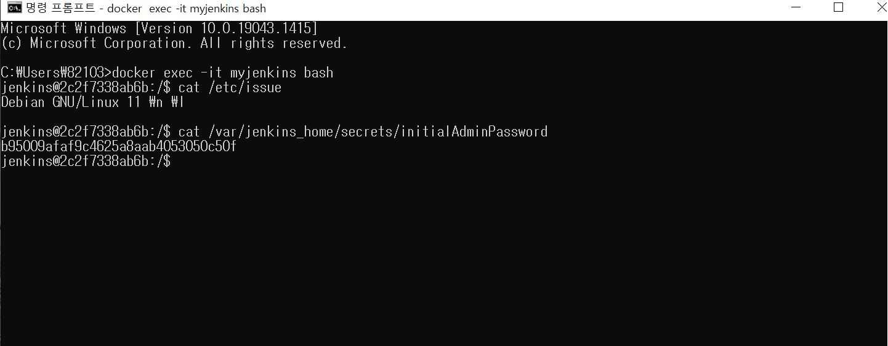
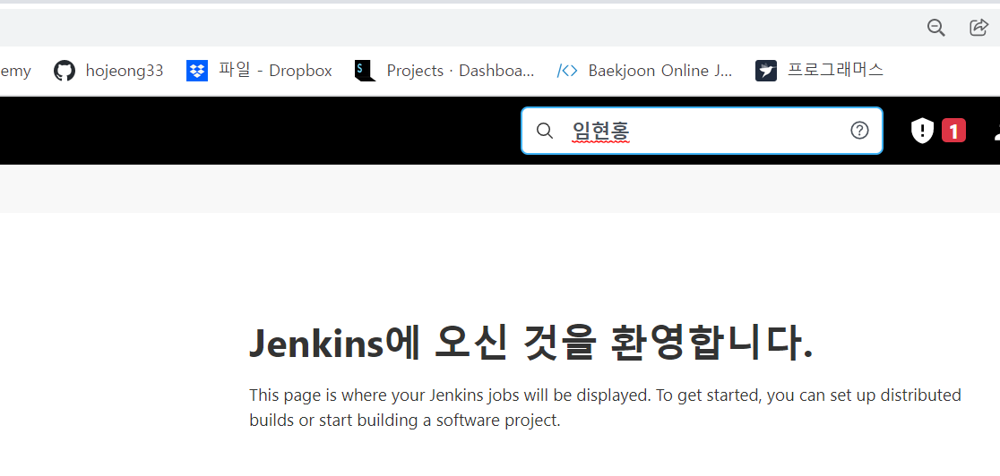
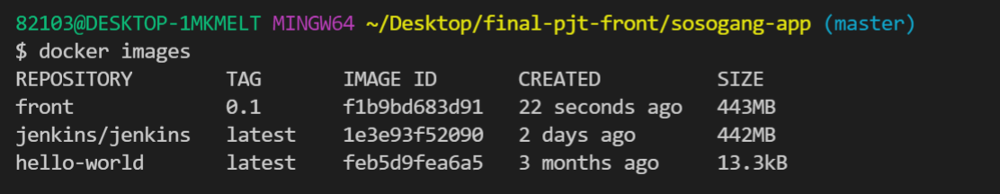
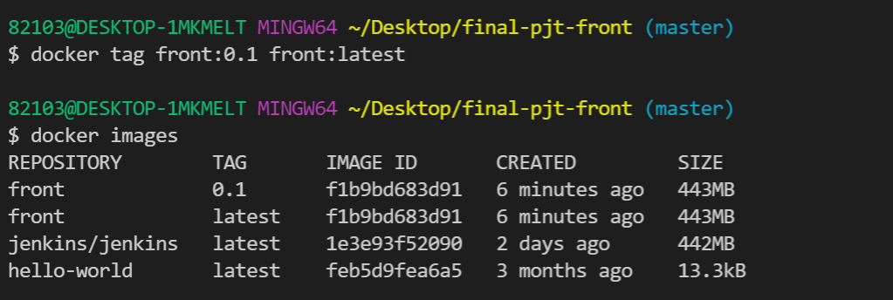
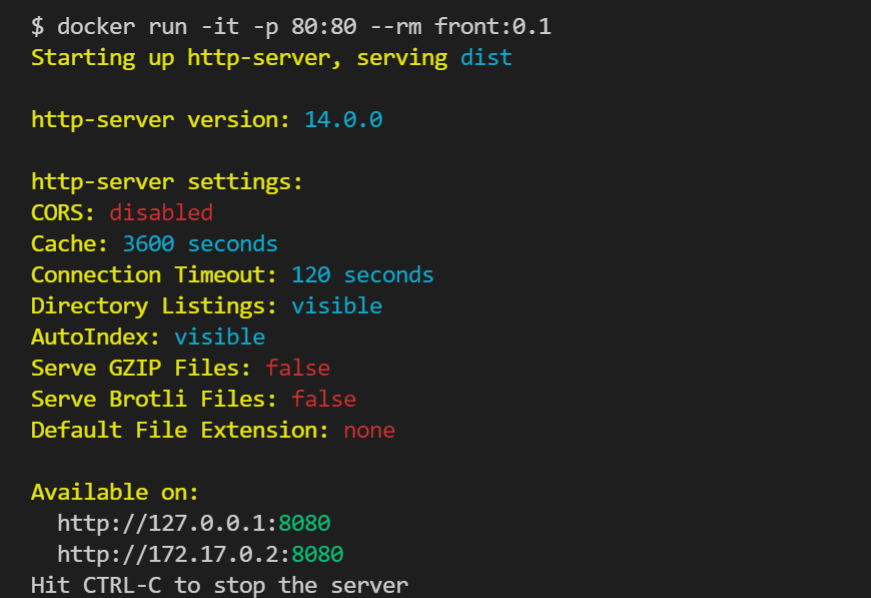
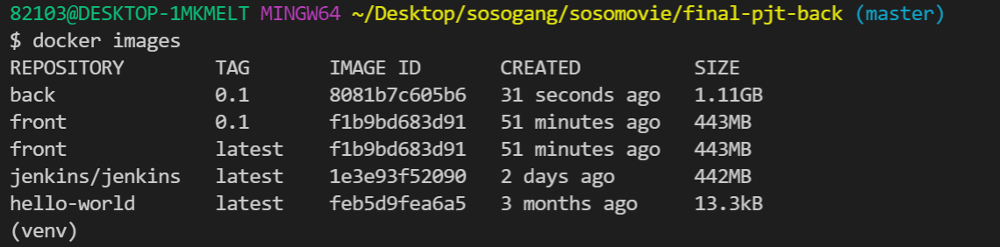
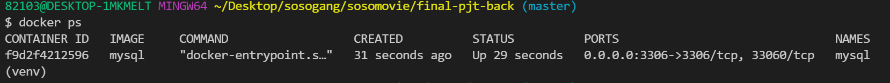
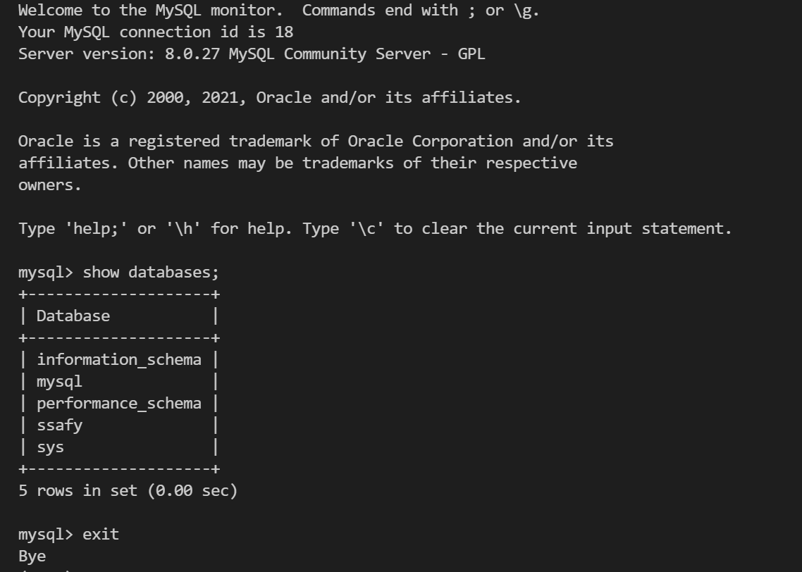

# 211224 Dockerize Project

## 개요

우리들은 로컬에서 개발하던 환경을 앞으로 지급받을 AWS 서버 환경에 직접 배포하게 되면 생소한 리눅스에 다양한 언어별 환경 구성, 의존성 패키지/라이브러리, 빌드 툴 등등.. 설치하면서 어려움을 겪을것입니다.

또한 매번 새로운 버전이 출시 되어 버전이슈도 발생하고 생각지도 못한 환경적인 문제로 코드가 새로운 배포 환경에서 예상처럼 동작해 주는 거을 보장받기 힘듭니다.

#### **도커는 이를 효율적으로 개선시켜줍니다**

os를 포함한 설치 과정은 Dockerfile로 문서화 되고 수정 이력은 버전 관리가 되어 변경사항을 쉽게 확인 가능합니다. 그래서 문제 발생시 언제든 롤백 하기도 편리하고 vm 이미지 대비 용량 및 실행속도가 월등히 빠릅니다.

#### 왜 개발자가 도커를 알아야 할까요?

요즘은 DevOps 문화가 확산되어 인프라를 잘 모르는 개발자도 쉽게 서버를 제작할 수 있고 개발하면서 자주 접할 가능성이 높습니다. 또한 도커를 사용하면 개발과정에서 필요한 환경 구성이 편리해 지고 여러 가지 서비스를 레고 블럭처럼 쌓아서 매쉬업 하기도 용이합니다.

도커로 우리의 서비스를 윈도우/맥/리눅스 가리지 않고 동일하게 동작함을 보장하는 불변서버로 이미지를 굽는 것처럼 제작한 다음 안전하게 격리도니 컨테이너 환경에서 구동 할 수 있습니다.


## 과제

> 1학기 관통 프로젝트를 기반으로 도커 이미지를 제작하고 컨테이너로 실행해 보는 과제입니다. 처음 도커를 접하는 교육생을 대상으로 하였으며 이미 도커를 잘 알고 있는 교육생은 심화과제까지 진행해 보기를 추천드립니다.


#### 목차

- 설치 및 명령어 실습
  - 도커를 설치하여 기본적인 이미지 및 컨테이너 사용 방법을 실습합니다.
- 여러가지 서비스 도커로 이용해보기
  - 도커 허브에 공개된 수 많은 유용한 이미지들 중에 샘플로 Jenkins를 docker run 명령어 한 줄로 쉽게 구축해 봅니다.
- 관통 프로젝트 코드로 도커 이미지 제작
  - 관통 프로젝트의 프론트엔드 와 백엔드를 각각 도커 이미지로 제작해 봅니다.

---

참고자료

| 구분        | 제목                 | 링크                                                         |
| ----------- | -------------------- | ------------------------------------------------------------ |
| 기초자료    | 도커튜토리얼         | https://www.44bits.io/ko/post/easy-deploy-with-docker        |
| 심화자료    | 도커 컴포즈를 활용   | https://www.44bits.io/ko/post/almost-perfect-development-environment-with-docker-and-docker-compose |
| 동영상 강의 | [따배도] 도커 시리즈 | https://www.youtube.com/playlist?list=PLApuRlvrZKogb78kKq1wRvrjg1VMwYrvi |


---

### 환경설정

#### 설치 

도커설치 : https://www.docker.com/products/docker-desktop

#### 설치 후 도커 버전 확인

```cmd
docker -v
```

#### 테스트용 Hello world 도커 컨테이너 실행

```cmd
docker run hello-world
```


### 도커 기본 명령어 실습

#### 컨테이너 조회 

```cmd
docker ps -a
```

생성 했었던 Hello world 의 컨테이너 아이디 조회가 됨

- TIP : -a 옵션은 정지(실행종료)된 컨테이너까지 조회하는 옵션


#### Hello world 컨테이너 삭제

```cmd
docker rm [컨테이너 ID 또는 NAME]
```

- 컨테이너 실행시 docker run --name=[컨테이너이름] 과 같이 --name 옵션을 추가하면 자동으로 만들어진 이름 대신 지정된 이름으로 컨테이너 생성 가능
- 컨테이너 ID는 앞 부분만 입력 가능 ex) docker rm 76


#### 도커 이미지 조회

```cmd
docker images
```


#### Hello world 도커 이미지 삭제

```cmd
docker rmi [이미지 id 또는 이미지명:TAG명 ]
```


### 샘플 서비스(Jenkins)를 이용한 도커 실습

#### jenkins 를 도커 컨테이너로 실행 및 실행(Up STATUS)중인지 확인

```cmd
docker run --name myjenkins -d -p 9080:8080 jenkins/jenkins


docker ps
```

> 참고 : docker hub 사이트 방문

Tip

- -d 옵션은 백그라운드 데몬으로 실행 시키는 옵션이고
  -p 는 가상머신에서 동작하는 서비스에 docker proxy 서비스가 NAT 기능을 수행 포트 포워딩을 해주어 실제 머신(HOST PC) ip로 서비스에 접속이 가능하도록 해준다.
- 컨테이너가 삭제되므로 보통 호스트 pc의 디렉토리에 데이터가 생성되도록 컨테이너에는 볼륨 마운트 옵션을 수가하여 실행시킵니다.
- 추가적인 옵션 : -v /your/home:/var/jenkins_home


#### Jenkins 서버 컨테이너의 bash 실행 후 컨테이너의 OS 버전 확인

```CMD 
docker exec -it myjenkins bash

jenkins@92552ea0b836:/$ cat / etc/issue
Debian GNU/Linux 10 \n \l
```




- 참고 : Jenkins 컨테이너는 bash가 포함되어 있지만 없는 서비스의 경우에는 bash 대신 sh를 사용해도 된다. 
- 참고: 윈도우 git-bash 에서 "the input device is not a TTY" 에러가 발생하면 명령 프롬프트(cmd) 창을 이용하거나 명령어 앞에 winpty 를 추가(예 : winpty docker exec -it myjenkins bash)
- 참고 : 컨테이너의 bsah가 실행된 상태는 마치 ssh로 리눅스 서버에 접속해서 명령어를 사용하는 것과 비슷하다.
- Tip : -it 옵션은 두 옵션이 합쳐진 옵션으로는 -i 는 interactive 모드로 표준 입출력을 키보드와 화면을 통해 가능하도록 하는 옵션이고 -t는 텍스트 기반의 터미널(TTY)을 에물레이션 해주는 옵션이다.


#### 컨테이너 안(bash) 에서 Admin 패스워드가 저장된 파일 확인 후 컨테이너 bash 종료

```cmd
jenkins@92552ea0b836:/$ cat /var/jenkins_home/secrets/initialAdminPassword
[패스워드가 출력됨]

jenkins@92552ea0b836:/$ exit
```


#### 참고 위의 두과정 한번에 실행하기

```cmd
docker exec myjenkins cat /var/jenkins_home/secrets/initialAdminPassword

[패스워드가 출력됨]
```

- Tip : docker loga myjenkis 명령어를 실행해서 컨테이너 실행 시 출력된 메시지에서도 패스워드 확인이 가능합니다.


#### 컨테이너 안에 있는 패스워드 파일을 개발 PC로 복사하기

```cmd
docker cp myjenkins:/var/jenkins_home/secrets/initialAdminPasswork ./

dir
initialAdminPassword
```

- 반대로 컨테이너 안에 파일을 복사해 넣으려면 다음 명령어로 가능하다

  `docker cp 파일명(개발 PC에서 복사시킬 파일) myjenkins:/var/jenkins_home(컨테이너 경로)`


#### 웹 브라우져에서 접속(http://localhost:9080) 해서 앞서 확인 한 패스워들 부여 넣고 Jenkins 설정을 계속 진행하기


확인 페이지 캡처



#### 컨테이너를 재 시작해서 Up status  시간이 초기화 된 것을 확인 후 삭제

```cmd
docker restart my jenkins
docker ps

docker rm -f myjenkins
```

- Tip : docker start/stop/restart 를 사용하면 마치 서비스를 시작/정지/재 시작 하는 거서럼 컨테이너 레벨로 서비스 제어가 가능하다.
- Tip : -f 옵션은 실행중인 컨테이너도 강제 삭제 가능
- 참고 : 앞에서 배운 이미지 삭제하는 명령어를 통해 Jenkins 이미지도 정리해 보자


### 관통 프로젝트 프론트엔드 도커 이미지 제작


#### 관통 프로젝트 코드 다운로드

```cmd
git clone ~~
cd [프로젝트폴더]

dir
frontend backend
```


#### 로컬에서 프론트엔드 실행 및 웹 프론트엔드 실행 및 웹 브라우저로 접속(http://localhost:8080) 해서 확인

```cmd
npm runserve
```

```cmd
cd frontend
yarn install
yarn serve
```


#### <project_home>/frontend/Dockerfile 을 작성 후 프론트엔드 용 도커 이미지 빌드

(Dockerfile 작성 참고: https://kr.vuejs.org/v2/cookbook/dockerize-vuejs-app.html)

node http-server를 사용하는 Simple Example 대신 개발환경이 아닌 운영 환경에서 많이 사용하는 NGINX 예제 사용을 권장

```CMD
docker build . -t front:0.1
...

Successfully built b35805335785
Successfully tagged front:0.1

docker images
```

결과창



- Tip : -t 는 도커 이미지 TAG 명으로 보통 버전 관리 용도로 사용한다.

- Tip: 도커 이미지 빌드시 sh: vue-cli-service: not found 가 발생하면 아래와 같은 내용을 추가

  RUN npm install --production
  RUN npm install @vue/cli-service <- 필요


#### 이미지에 TAG 추가하기

```cmd
docker tag front:0.1 front:latest

docker images
```

결과화면



- Tip : 도커 이미지 삭제하는 명령어로 TAG를 삭제하고 실제 이미지는 모든 TAG가 삭제될 때 삭제된다.


#### 도커로 프론트엔드 실행 및 웹 브라우져로 접속(http://localhost) 해서 확인

```cmd
docker run -it -p 80:80 --rm front:0.1
```

- Tip : --rm 은 컨테이너가 정지되면 자동으로 삭제되는 옵션이고 임시테스트용으로 컨테이너를 실행시켜 보는 용도로 유용하다.
- Tip : 컨테이너가 포그라운드로 실행 중이므로 `Ctrl + C`키 입력으로 종료한다.



### 관통 프로젝트 백엔드 도커 이미지 제작


#### 자바, 스프링부트 예시

```cmd
cd backend
mvnw package
java -jar target\backend-0.0.-SNAPSHOT/jar
```


#### <project_home>/backend/Dockerfile 을 아래 링크를 참고해서 작성한 다음 백엔드용 도커 이미지 빌드

```cmd
docker build . -t back:0.1

Successfully built 71d57b43c6ec
Successfully tagged back:0.1

docker images
--> 항목들이 출력됨
```


#### 도커로 백엔드 실행 및 확인(http://localhost:8080/swagger-ui.html)

```cmd
docker run -t -p 8080:8080 --rm back:0.1
```

- Tip : --rm은 컨테이너가 정지되면 자동으로 삭제되는 옵션이고 임시 테스트용으로 컨테이너를 실행시켜 보는 용도로 유용하다.


### 2. 파이썬 장고 예시

#### 로컬에서 백엔드 실행 및 확인(http://localhost:8000)

```cmd
cd backend
python manage.py runserver
```

대기 후  서버 주소 확인 --> 잘 돌아갑니다.


#### <project_home>/backend/Dockerfile을 아래 링크를 참고해서 작성ㅇ한 다음 도커 이미지 빌드

- 운영환경에서는 NGINX +Gunicorn 을 주로 사용하지만 복잡하므로 개발서버로 간단히 Dockerfile 작성(참고 링크의 Dockerfile에서 설명 주석은 제거해야 정상 빌드 됨)
- requirements.txt로 의존성 패키지 파일이 없다면 pip freeze > requirements.txt

```cmd
docker build . -t back:0.1
```

결과화면




#### 도커로 백엔드 실행 및 확인(http://localhost:8000)

```cmd
docker run -it -p 8000:8000 --rm back:0.1
```

- Tip : --rm 은 컨테이너가 정지되면 자동으로 삭제되는 옵션이고 임시 테스트용으로 컨테이너를 실행시켜 보는 용도로 유용하다.


#### 개발용 DB로 사용할 MySQL 컨테이너 실행 및 정상 실행 여부 조회(docker ps)

```cmd
docker run --name mysql -p 3306:3306 -e MYSQL_ROOT_PASSWORD=ssafyssafyrommromm -e
MYSQL_DATABASE=ssafy -d mysql --character-set-server=utf8mb4 --collation-server=utf8mb4_unicode_ci
```

- 참고 : -e 옵션은 컨테이너 os의 환경 변수로 전달하는 방법입니다. mysql 컨테이너가 실행되면 호출되는 docker-entrypoint.sh 에서는 여러분이 전달한 환경변수와 commend argument 등 여러분이 원하는 password.db 명 들을 전달받아 성정해 줍니다. 도커 이미지를 제작할  때 이러한 옵션들을 제공해 주어야 보다 많은 개발자가 편리하게 활용 가능하다는것을 알 수 있습니다.

##### 결과화면




#### MySQL 서버 컨테이너 안에 포함되어 있는  mysql 클라이언트 명령어를 실행시켜 DB접속 테스트

```cmd
docker exec -it mysql mysql -uroot - ssafy
Enter password : [패스워드입력]
```

password는 위에서 입력한 패스워드 사용!





끝!


