# git 작업 최우선 사항


## merge는 다같이 무적권!!!!!!!!!!!!!


## merge완료 이후 다같이 pull 받기


## 이후 다시 브랜치 이동 이동 후 개인작업 재개


### 설정사항 

gitlab에 deploy, develop 브랜치 생성  --> 가시성을 위함

모두 같이 pull을 받은 상태라면??

```bash
# 다같이 merge를 완료하고, 모두 병합 되었기 때문에 각 브랜치에도 모든 변경사항이 업데이트 되어있음
$ git checkout -b 브랜치명 #브랜치 생성과 동시에 생성된 브랜치로 이동합니다.

# 작업시작
$ git commit -m "[이슈번호] 작업한 기능 명 : 상세정보"
$ git push

# 만약 공통적으로 수정해야하는 파일이 생겼다면?
# 수정 한 내용을 한명이 먼저 commit -> push -> merge

# 다른 사람이 급히 수정한 내용을 받을려고 할 때 

$ git stash # 임시 저장

$ git checkout develop(merge 한 branch)
$ git pull

$ git checkout 개인작업branch

$ git stash apply

```


## 실행순서

online 저장소에서, branch 생성!

이후 다같이 pull을 받습니다!

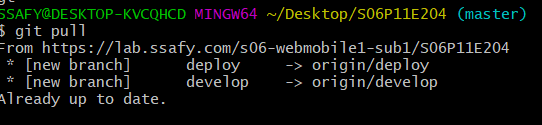

생성된 origin branch 들이 origin 에도 생성 된 모습!


이후 각자 작업 할 branch 생성!

```bash
$ git checkout -b 생성할브랜치 명
```


개인작업 수행중...

...

...

...


이제 commit 과 push를 해보자!

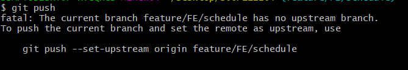

이런 에러가 떳을 경우!

전역 설정을 통해 해결 해 준다.

```bash
$ git config --global push.default current
```

위 커맨드와 같이 push의 기본 행동으로 current를 지정하면 현재의 브랜치와 동일한 이름의 브랜치에 push를 할 수 있다.


현재 상황 각자의 branch 에서 push를 하여 gitlab 저장소에도 push 가 된 상태

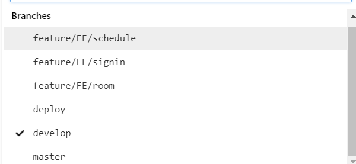

이렇게 된 모습

그럼 각자 merge를 시켜보자!


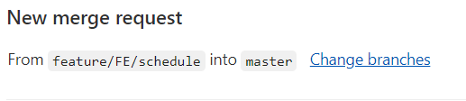

반드시 into가 병합하려는 branch 인지 확인!

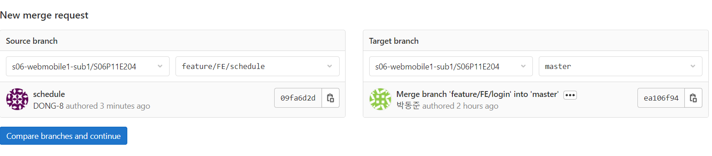

원하는 branch 로 변경시켜줍시다


이후 merge

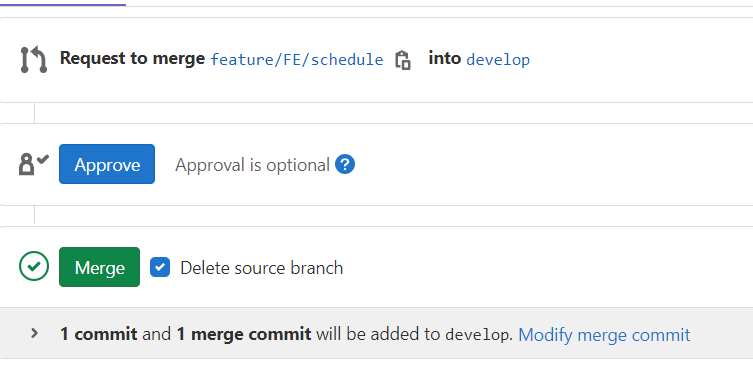

충돌 없이 작동 된 모습

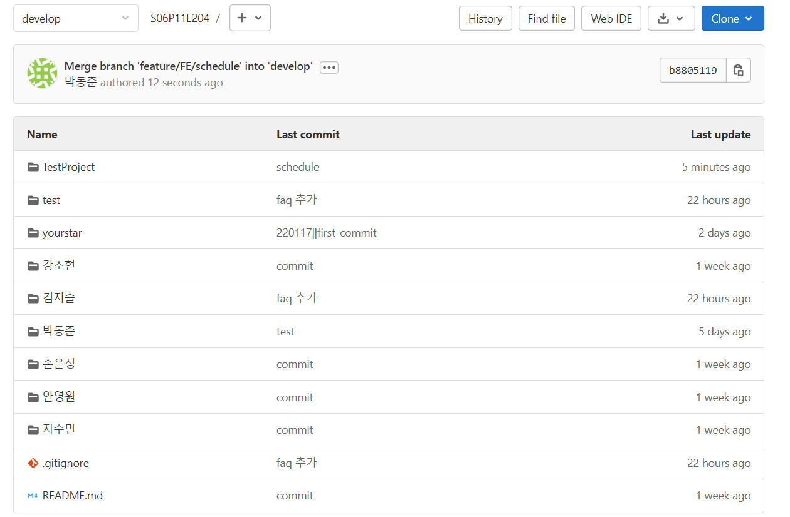

저장 된 모습


devlop -> deploy로 merge 할때는 branch 제거 하지말 것!

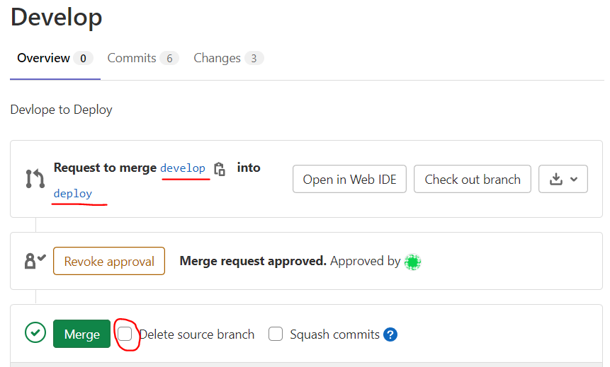

그렇다면 우리가 이제 다시 작업을 할려고 한다면 어떻게 해야할까!?

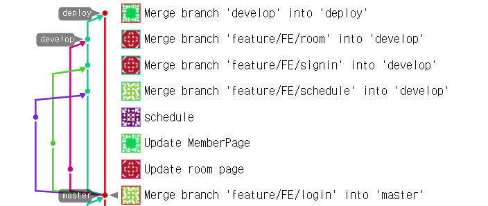

이제 각자의 병합 과정이 완료 되었다!

이제 master 에도 merge를 시켜보자

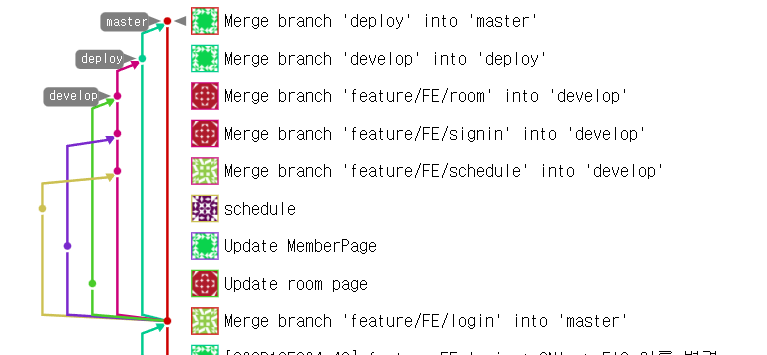

완료!


## 이제 그럼 우리는 다시 어떻게 작업해야할까?

모든 브랜치의 내용이 master로 옮겨졌고, 각가의 브랜치도 현재 master와 동일한 자료를 바라보고 있기 때문에,

### 우리는 local(우리의 노트북,데스크톱 작업공간) 에서 

현재 위의 작업내용으로 보았을 때 우리는 master 로 이동 해 줍니다.

```bash
$ git checkout '최종적으로 병합된 branch' #로 이동
$ git pull
$ git checkout devlop
$ git pull
```


이후 각자의 branch 생성 후 작업 동일 반복 하시면 됩니다.


## 충돌이 일어났을 때

현재 같은 파일을 3명이서 작업 해버린 상태

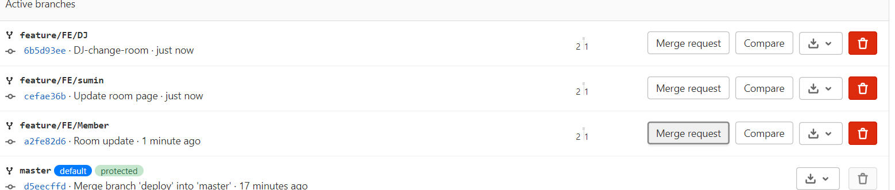

3개만들어 졌고 하나를 merge

하나는 멀쩡히 되었습니다

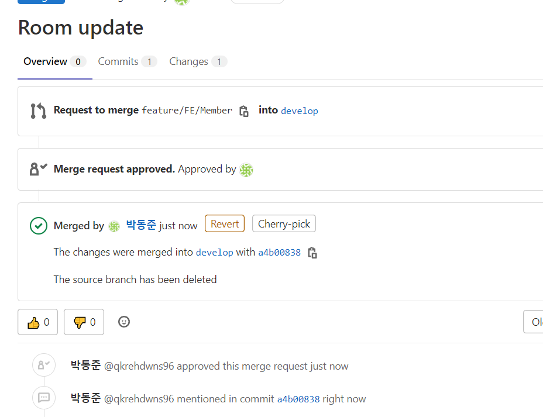


하지만 이론상 이제는 문제겠죠?

한번 봅시다.

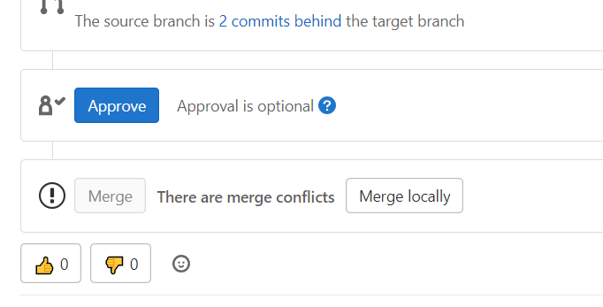

나버렸쥬?ㅋㅋㅋㅋㅋㅋ루삥뽕

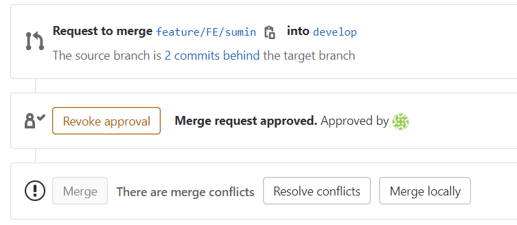

승인하고 resolve conflicts 눌려줍니다.

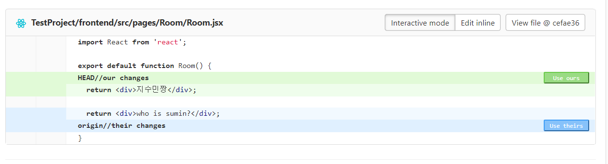

충돌이 난 내역에 대해서 보여주고

사용 할 코드를 클릭시켜 줍니다

변경 후

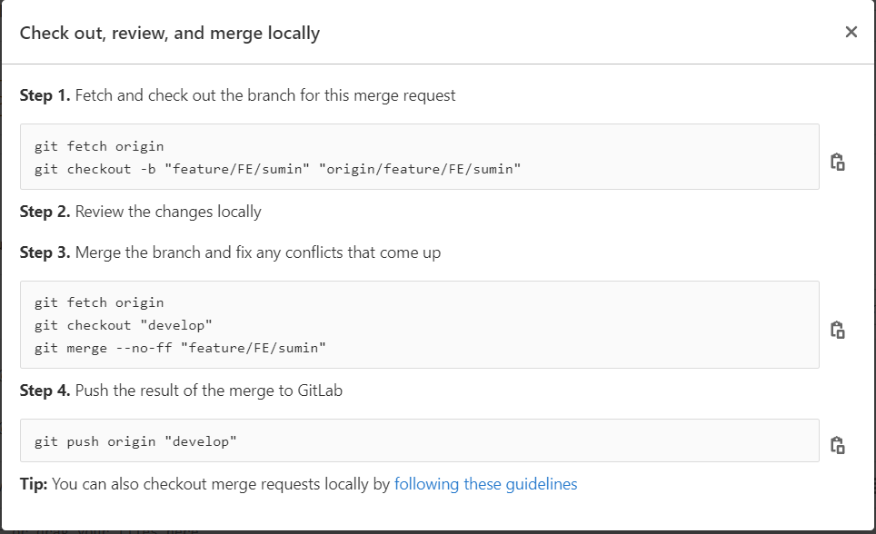

이런 화면을 볼 수 있을텐데유


step 3부터 진행 해 줍니다

step 4를 진행하기 전


```bash
$ git pull
```

변경해줄 코드를 선택

```bash
$ git push origin "최종 병합 할 branch"
```

이러면 충돌 해결 및 두가지 파일이 합쳐집니다.