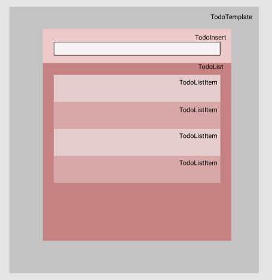

## react-icons

- react에서 아이콘 사용하기
- `$ yarn create react-app todo-app`

https://react-icons.github.io/react-icons/

# 구조



# 스타일링

```jsx
input {
	&::placeholder{
		color: colar;
}}
```

- input의 placeholder 글자색 바꾸기

```jsx
button {
	transition:0.1s background ease-in;
	&:hover{
		background:#yellow;
}}
```

- 호버하면 버튼 색 서서히 바뀌게 하기

```jsx
.TodoListItem{
	&:nth-child(even){
		background: #red;
}
.checkbox{
	svg{
		font-size:1.5rem;
	}
	&.checked{
		svg{
			color:blue;
		}
		.text{
			text-decoration:line-through;
	}
}
```

- 짝수열만 색 바꾸기
- 체크박스 안  아이콘 크기 바꾸기
- 체크가 되게 되면 그 안의 속성 바꾸기

```jsx
&+&{
	border-top:1px solid #black;
}
```

- 엘리먼트 사이사이에 테두리 넣어주기

# 기능 만들기

# Todos

웬만한 state 관리 는 최상위 컴포넌트인 App.js 에서 하는게 유리하다

1. App.js에서 todos를 state로 만들어준다.

```jsx
const [todos,setTodos]= useState([
    {id:1,
    text:'리액트하기',
    checked:true},
    {id:2,
      text:'리액트또하기기',
      checked:false},
])
```

1. 이 todos(state)를  TodoList로 보내준다

```
<TodoList todos={todos}/>
```

1. TodoList에서 받아준 뒤 map을 이용해 TodoListItem으로 보낸다.

```jsx
const TodoList = (todos)=>{
  return (
    <div className="TodoList">
      {todos.map(todo=>(
        <TodoListItem  todo={todo} key={todo.id} />
      )
    )}
    </div>
  )
}
```

1. TodoListItem에서 받아준 뒤 사용하면 된다.

```jsx
import cn from 'classnames'
const TodoListItem =(todo)=>{
  const {text,checked,id} = todo
  return (
    <div className='TodoListItem'>
      <div className={cn('checkbox',{checked})}>
        {checked? <MdCheckBox/>:<MdCheckBoxOutlineBlank/>}
        <div className='text'>{text}</div>
      </div>
      <div className='remove'>
        <MdRemoveCircleOutline/>
      </div>
    </div>
  )
}
```

- class속성을 두개 이상 주고 싶을 경우 ?

- classnames를 불러온 뒤

  일반 형 `‘checkbox’` 값이 true일 때만 나오는 형태`{checked}`

- `{checked? <MdCheckBox/>:<MdCheckBoxOutlineBlank/>}` 체크가 true면 앞의 형태를 false면 후자를 출력한다.

# CREATE

### TodoInsert에서 value 라는 state를 만들고

### input 값으로 들어오는 값을 value로 만든다.

```jsx
const TodoInsert = (**{onInsert}**)=>{
  const [value,setValue] = useState('')
  const onChange = useCallback((e)=>{
    setValue(e.target.value)
  },[])
  const onSubmit = useCallback(
    e=>{
      **onInsert(value)**
      setValue('')
      e.preventDefault();
    }
  ,[onInsert,value])
  return (
    <>
      <form onSubmit={onSubmit} className='TodoInsert'>
        <input 
        value = {value}
        onChange={onChange}
        placeholder='할일을 입력하세요'/>
        <button onClick={onSubmit} type='submit'>
          <FaFly/>
        </button>
      </form>
    </>
  )
}
```

- value를 state를 만들고
- onChange를 통해서 바뀌는 값을 value로 계속 바꿔준다.
- onSubmit 하게 되면 onInsert()를 통해 todos에 추가를 한뒤 새로고침을 막기 위해 preventDefault를 실행시킨 후  , value를 초기화 시켜준다.

### App.js에서 `onInsert()` 를 만들어 보내줘야한다.

```jsx
const nextId = useRef(4);
const onInsert = useCallback(
  text=>{
    const todo= {
      id:nextId.current,
      text,
      checked:false
    }
    setTodos(todos.concat(todo))
    nextId.current+=1;
  }
,[todos])
```

- ## 다음 Id 값을 useRef()를 사용한다.

- onInsert 는 useCallback 함수를 사용했다.

  - **props로 전달해야 할 함수를 만들 때는 useCallback 함수로 감싸야 한다.**
  - todo를 만드는데,text의 값을 data가 하게 된다.( `onInsert(data)` )
  - Todos에 todo를 concat()으로 더해준다.

- `<TodoInsert onInsert={onInsert}>` 로 보내주기

# DELETE

### App.js에서 onRemove()함수를 만든다.

```jsx
const onRemove = useCallback(
  id => {
    const newtodos = todos.filter(todo=>todo.id!==id)
    setTodos(newtodos)
  },[todos]
)
```

- props로 보내줄 것이므로 useCallback 으로 묶어 주고
- 새로운Todos는 todos에 filter를 사용해 todo.id값이 가져온 id가 아닌 것만 저장한다.
- 그 값으로 Todos 저장해준다.
- `<TodoList onRemove={onRemove}>`로 보내주기

### onRemove를 사용할 TodoListItem 까지 내린다

```jsx
const TodoList =({todos,onRemove})=> { ...
	<TodoListItem ... onRemove={onRemove}  />}
```

### TodoListItem에서 사용하기

```jsx
<div onClick={()=>onRemove(id)}  className='remove'>
  <MdRemoveCircleOutline/>
</div>
```

- 아이콘을 누르게 되면 onRemove함수를 id를 가지고 실행하게 된다

  - 클릭해서 다른 함수를 실행시키고 싶다면 함수 형태로 적어야 한다.

    `onClick = {()⇒onRemove(id)}`

# UPDATE

### App.js에서 onToggle() 함수 생성 (완료되게하기)

```jsx
const onToggle = useCallback(
    id =>{
      setTodos(
        todos.map(todo=>todo.id === id ? 
          {...todo,checked:!todo.checked}:todo)
      )
},[todos])
```

- props로 넘겨줄 값이라 useCallback으로 묶어주기
- todos중에 todo.id가 들고온 id가 맞다면 ?
  - `{...todo,checked:!todo.checked}` 로 todo를 똑같이 만들고 check만 바꿔준다
  - id가 틀리다면 todo를 그대로 돌려준다 .
- `<TodoList onToggle={onToggle} onRemove={onRemove} todos={todos}/>` 로 내려준다.

### onToggle를 사용할 TodoListItem 까지 내린다

```jsx
const TodoList =({todos,onRemove,onToggle})=> { ...
<TodoListItem onToggle={onToggle} onRemove={onRemove} todo={todo} key={todo.id} />
}
```

### TodoListItem에서 사용하기

```jsx
<div onClick={()=>onToggle(id)} className={cn('checkbox',{checked})}>...
</div>
```

- 클릭하면 onToggle()를 id를 포함하며 실행

CRUD의 모든 기능이 구현되었다 . Todo만 반복 숙달되면 다른 것도 쉽게 만들 수 있을 것 같다.