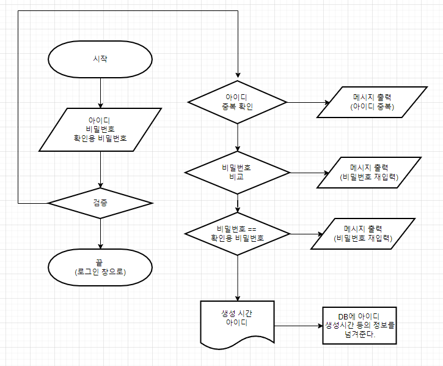

# 알고리즘 디자인 설계

0. 로그인을 위해서는 회원가입 기능이 필요하다.

1. 외부로 부터 필요한 데이터 값인 아이디 & 비밀번호, 확인용 비밀번호 를 받는다.

   1-1. 전송방식은 post로 json 타입으로 전해 받는다.

   1-2. 전송되는 객체 변수 값은 api 설계서에 변수 생성 규칙을 사용한다.

2. 데이터 값은 검증 조건이 필요하다.

   1. 아이디에는 특수문자가 있으면 안된다 -> 있으면 err 리턴
   2. 아이디는 숫자 or 영어가 한자리 이상 포함 되어야 한다.
   3. 아이디는 자릿수가 6자리 이상이어야 한다.
   4. 비밀번호와 확인용 비밀번호가 같아야 한다.
   5. 비밀번호는 특수 문자가 1개 이상 포함되어야 한다.

   6. 아이디로 회원 테이블을 조회해 중복 확인을 한다.
   7. 위의 내용을 충족하지 않으면 err 리턴 

3. 회원가입이 완료되면 로그인 창으로 이동한다 

   1. 다시 로그인을 함으로써 비밀번호를 상기시킬 수 있다. 

4. 끝


# Flowchart 작성



1. 아이디에는 특수문자가 있으면 안된다 -> 있으면 err 리턴
2. 아이디는 숫자 or 영어가 한자리 이상 포함 되어야 한다.
3. 아이디는 자릿수가 6자리 이상이어야 한다.
4. 비밀번호와 확인용 비밀번호가 같아야 한다.
5. 비밀번호는 특수 문자가 1개 이상 포함되어야 한다.

6. 아이디로 회원 테이블을 조회해 중복 확인을 한다.
7. 위의 내용을 충족하지 않으면 err 리턴 

# Pseudo-code 작성

```
function 문자열의 특수문자,숫자,영어 포함 여부 검사
input 문자열
output 참 or 거짓

function 문자열 길이 확인 검사
input 문자열
output 참 or 거짓

start 회원가입
set 외부에서 받아온 아이디 
set 외부에서 받아온 비밀번호
set 외부에서 받아온 비밀번호 확인
set 외부에서 받아온 이름, 이메일(선택)

if (아이디 function 영어, 숫자,특수문자 검사
	and 아이디 길이 6자리 이상
	and 비밀번호 특수문자 , 확인용 길이 같은지 
	and 비밀번호 특수문자 검사 
)
else (
	return 비밀번호 확인 
)
else (
	return 아이디 중복 or id 확인
)
return 성공메시지 & 로그인 창으로 이동
end 

```

